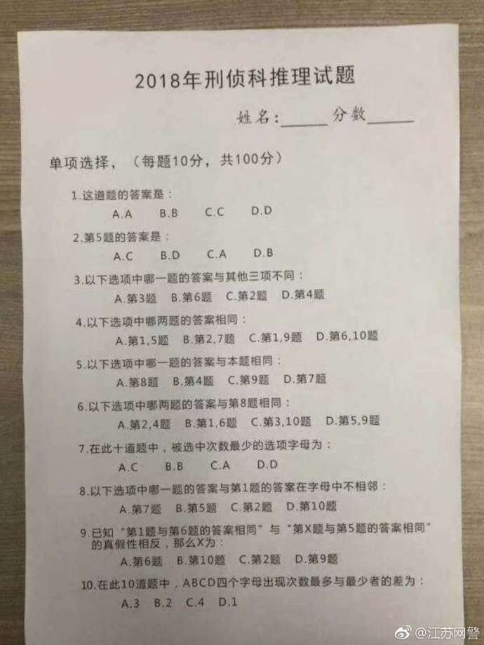

# 2018年刑侦科推理试题

# 2018-Criminal-Investigation-Reasoning-Questions

网上流传的“2018年刑侦科推理试题”简单粗暴的Python解法及答案。

原本我并没打算做，但是女朋友竟然想这个题到两点都没睡着，所以作为一名正义的守护者我怎能坐视不管。稍作分析发现比较复杂，可能得花很久，遂花一个小时写了个小程序，1.2秒就算出来了，解救了一个苦难中的人儿:)

The 2018 criminal investigation reasoning questions' straight forward python solution and the answer.

At first I didn't plan to answer the questions, however my girlfriend thinking about this till 2 o'clock. As a protecter of justice, I cannot sit and watch. After an small analyze, it may take me a long time to get the answer by my hand so I spent 1 hour wrote a small program, which takes only 1.2 seconds to calculate the answer and save a lovely soul.

## 题目如下：

## Questions:

### Single Choice(10 points/question, totally 100 points.):

1. What's the answer of this question:

A.A    B.B    C.C    D.D

2. What's the answer of the fifth question:

A.C    B.D    C.A    D.B

3. Which one of the questions' answer is different from the other three:

A.3rd    B.6th    C.2nd    D.4th

4.  Which two of the questions' answers are the same:

A.1st and 5th    B.2nd and 7th    C.1st and 9th    D.6th and 10th

5. Which question's answer is the same as this one:

A.8th    B.4th    C.9th    D.7th

6. Which two of the questions are the same as the 8th question:

A.2nd and 4th    B.1st and 6th    C.3rd and 10th    D.5th and 9th

7. The least chose letter among the ten questions is:

A.C    B.B    C.A    D.D

8. Which question's answer letter is not near the 1st question's answer:

A.7th    B.5th    C.2nd    D.10th

9. Given "The 1st question's answer is the same as the 6th's" and "The Xth question's answer is the same as the 5th's" two statements. One is true and the other is false. Then X is:

A.6th    B.10th    C.2nd    D.10th

10. Among the 10 questions, the substraction of the most letter and the least letter appears as an anser between the four letters A B C D is:

A.3    B.2    C.4    D.1

# 答案 ANSWERS:

自己运行Python文件：）

Run the python file yourself :) 

如果非要我告诉你的话：（从10到1）

If you still want the answers: 

From 10 to 1:

a b a d c a c a c b